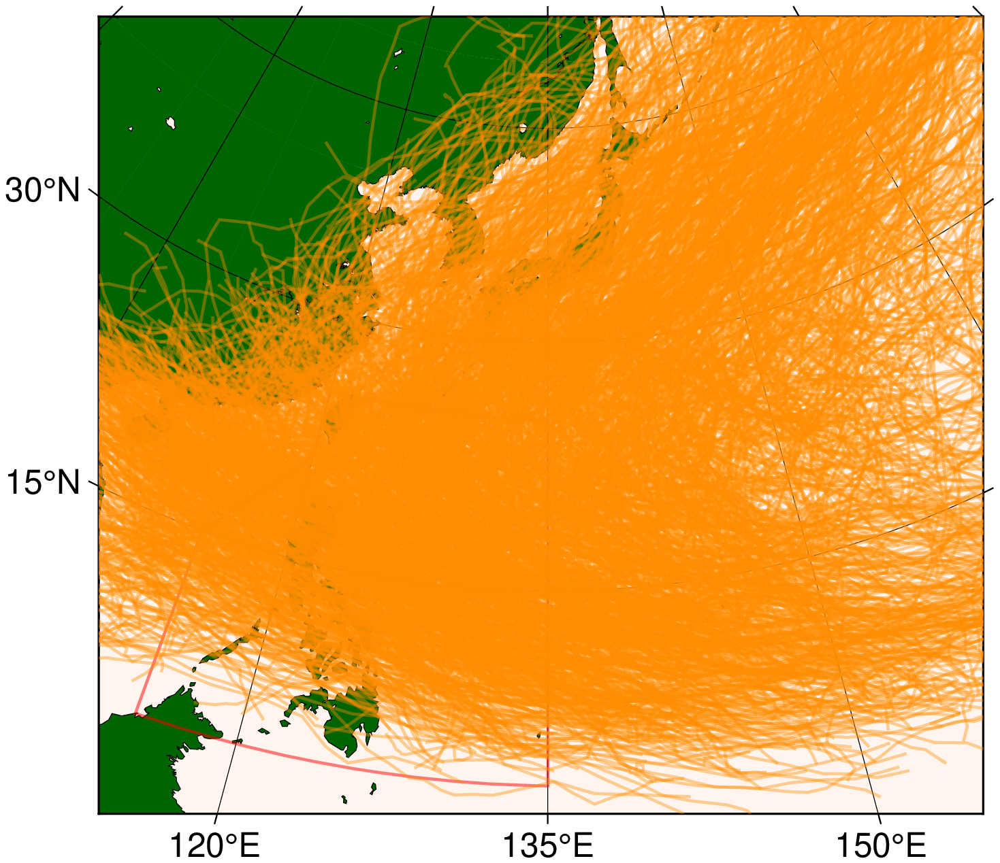

# Plotting Data
In this section, we will discuss the visualization APIs.
## Plotting Best Track
Loading the data
```@repl abc
using Bagyo
bst = BestTrack(JMAData())
download(bst)
meta, data = BestTrack{JMAData} |> load;
plot(BestTrack{JMAData}, data)
```
```@raw html

```